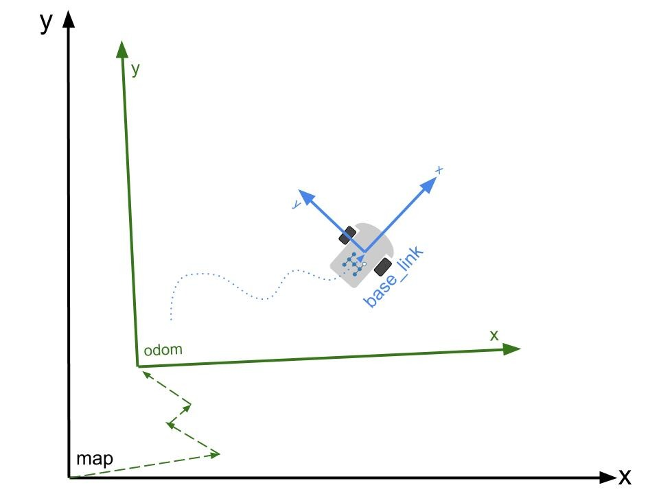
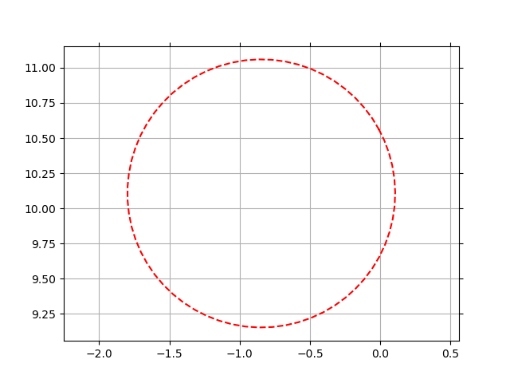

# Localization algorithm





---

- [Localization algorithm](#localization-algorithm)
  - [Install](#install)
  - [Data Description](#data-description)
    - [Rosbag](#rosbag)
    - [CSV files](#csv-files)
  - [Technical description](#technical-description)
  - [Performance analysis](#performance-analysis)
  - [Work description](#work-description)

---

In this repository, I developed a localization algorithm for a car equipped with wheel encoders and a global navigation satellite system (GNSS) receiver. 
The wheel encoders provide linear and angular speed information, while the GNSS provides position information. 

The following assumptions are made:
- The sensors are mounted in the center of the rear axle of the car.
- The car is moving on a 2D plane.
- The position is expressed in the ``map`` frame. The ``map`` and ``odom`` frames are identical in our scenario.
- The measurements are affected by some noise, the estimated covariances of which are provided.

The expected output of the algorithm is the following:
- Estimated position and orientation of the car in the ``map`` frame.

## Install

The code comes with a ready-to-use conda environment:
```
git clone https://github.com/Davidelanz/localization-algorithm
cd localization-algorithm
conda env create -f environment.yml 
conda activate localization-algorithm
jupyter-lab
```

With the previous commands, you should be able to navigate easily the notebooks provided in the repository at http://localhost:8888/lab.

## Data Description

The input is provided both as a rosbag and CSV files.

### Rosbag

The rosbag ``data/data.bag`` contains the following topics:
- ``/sensors/gnss/odom``: GNSS position measurements of the car in the ``map`` frame.
- ``/sensors/odom``: linear and angular speed measurements of the car with respect to the ``odom`` frame, in the frame of the car (``x`` axis pointing forward, ``y`` axis pointing left)


### CSV files

For all CSV files, the time is given as a Unix timestamp (in nanoseconds), position is in metre, and speed in metre/second. The provided files are the following:
- ``data/gnss.csv``: GNSS 2D position measurements of the car in the ``map`` frame. The estimated standard deviation on the measurements is 0.7 m.
- ``data/odom.csv``: linear and angular speed measurements of the car with respect to the ``odom`` frame, in the frame of the car (``x`` axis pointing forward, ``y`` axis pointing left). The covariances on the measurements are also provided.
- ``data/ground_truth.csv``: true position and speed of the car, given for reference. The orientation is expressed as a quaternion. The speed is given with respect to the ``odom`` frame, in the frame of the car.


## Technical description 

~~Technical description of the work~~

## Performance analysis

~~Performance analysis of the algorithm~~

## Work description

The work description along with the various development phases is made available in the ``work_description.ipynb`` notebook.